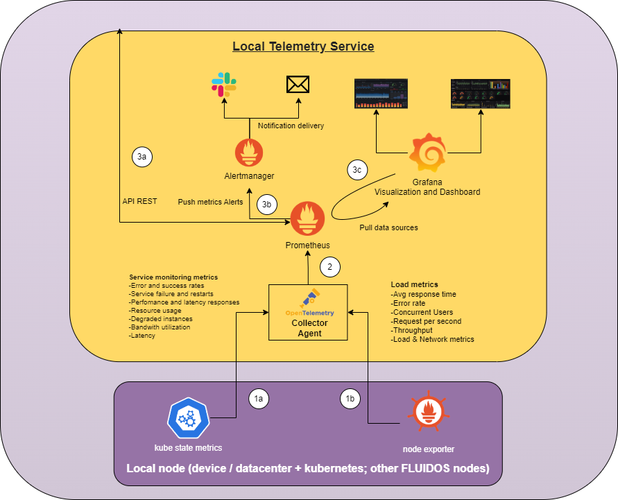

# Telemetry
This repository will host the telemetry aspect of this project.

- [Telemetry](#telemetry)
  - [Relevant concepts](#relevant-concepts)
  - [Telemetry in FluidOS](#telemetry-in-fluidos)
  - [Tools used in the project](#tools-used-in-the-project)
  - [Overview of the deployment](#overview-of-the-deployment)
  - [Getting started](#getting-started)
    - [Prerequisites](#prerequisites)
    - [Minikube](#minikube)
    - [Starting the services](#starting-the-services)
    - [Opening the services](#opening-the-services)
    - [Grafana](#grafana)
    - [Generating load](#generating-load)
    - [Asking prometheus for metrics](#asking-prometheus-for-metrics)
    - [Prometheus rules](#prometheus-rules)
    - [Stopping the demo](#stopping-the-demo)

## Relevant concepts
Is related to observability and telemetry.
- Observability lets us understand a system from the outside, by letting us ask questions about that system without knowing its inner workings. Furthermore, it allows us to easily troubleshoot and handle novel problems, and helps us answer the question, "Why is this happening?"
- Telemetry, on the other hand, is the process of gathering, measuring, and transmitting data about the performance, status, and behavior of a system or a device in real-time. This data can include metrics like CPU, memory, storage, or network traffic.

Monitoring is the process by which the infrastructure is constantly checked for problems. Thanks to monitoring, the system administrators con make a better use of the technological resources, they can know the needs of the our infrastructure and anticipate to them. Finally, since the sysadmins will know the normal state of the infrastructure, they can easily detect threats and anomalies.

## Telemetry in FluidOS
To make a more understable telemetry, the following methods will be used:
- Alerts: whenever abnormal values are detected, the system should create notifications for prompt action.
- Dashboards: utilizing visualization tools, administrators can quickly access real-time updates on system activies.

In order to gain a comprehensive understanding of the infraestructure, transformations and filters will be applied to the gathered metrics and logs.

The data will be supplied to the Node Orchestrator for optimal resource utilization and perfomance.

Furthermore, the Security Agent can utilize this data to develop robust policies that enhance the overall security of the infrastructure.

## Tools used in the project
- [kube-state-metrics](https://github.com/kubernetes/kube-state-metrics)
  - Simple service that listens to the Kubernetes API server and generates metrics about the state of the objects.
  - Expose the metrics in a /metrics endpoint in Prometheus format.
- [Node exporter](https://github.com/prometheus/node_exporter)
  - Exposes a wide variety of hardware and kernel related metrics.
- [OTEL Collector](https://opentelemetry.io/docs/collector/)
  - Vendor-agnostic implementation of how to receive, process and export telemetry data.
  - Works with improved scalability and supports open source observability data formats.
- [Prometheus](https://prometheus.io/)
  - Open-source monitoring system and alerting toolkit.
  - Collects and stores metrics as time series data.
  - Time series collection happens via a pull model over HTTP.
- [Grafana](https://grafana.com/)
  - Open-source visualization and analytics software.
  - Allows to query, visualize, alert on, and explore metrics, logs and traces.

## Overview of the deployment


1. Telemetry is collected from the nodes and is sent to the OTEL Collector. The telemetry comes from:
    
    1a. kube-state-metrics
    
    1b. Node exporter
2. The metrics in the OTEL Collector are sent to Prometheus.
3. Once the metrics are in Prometheus, they can travel to three destinations:
   
   3a. Thanks to the API REST, components can ask for metrics.
   
   3b. The AlertManager also needs metrics to create and send alerts.
   
   3c. Grafana will be pulling metrics from Prometheus to create dashboards.

## Getting started

### Prerequisites
- A Kubernetes environment (This deployment has been done with minikube)
- Python (This project has been tested with version 3.11.1)
  - prometheus-api-client (As specified in api/requirements.txt)

### Minikube
This project has been tested with minikube (https://minikube.sigs.k8s.io/docs/start/), using docker container as environment.

- To start the minikube cluster with 2 nodes:
```shell
    minikube start --nodes 2
```
- In the Makefile there is a shortcut to do the same: ```make start```

### Starting the services
In order to run the services, we need to apply all the configurations. There is another shortcut in the Makefile: ```make run```. Using this command will provide the infrastructure with the followings components:
- Prometheus
- Node Exporter
- kube-state-metrics
- Grafana
- OTEL Collector
- Alert Manager

We can check that every component is working with: ```kubectl get all -n monitoring```

### Opening the services
Executing: ```minikube -p multinode-demo service -n monitoring {SERVICE_NAME}``` will open the service in order to access it. E.g: 
```shell
minikube -p multinode-demo service -n monitoring grafana
```
To make grafana accessible.

### Grafana
Once Grafana is running and the service is accessible, we should be able to check the metrics. To ease this task we should import a precreated dashboard. 
1. Log in as admin, with password admin
2. Click on dashboards, New --> Import
3. Select the grafana.json that is in the kubernetes-grafana folder.

### Generating load
To check that the metrics and the dashboard update with changes, this project have a test already created, in order to run it you should: ```make run-php``` and ```make run-load```. After waiting a couple of minutes, the changes will be noticeables.

Once the test is completed, CTLR + C to stop the run-load and ```make delete-php``` to delete the deployment and service.

### Asking prometheus for metrics
In this repository there is a python script to test the Prometheus API, in order to run it, it is needed to change the IP:PORT to the Prometheus service in ```python api/get-example.py```

### Prometheus rules
The rules are already defined in kubernetes-prometheus/config-map.yaml in the prometheus-rules section. In order to connect the alerting with the alert manager, the port in that section should be the same to the one in ```kubernetes-alertmanager/alertmanager-service.yaml```

### Stopping the demo
Using ```make delete``` will delete all the deployments, services... and ```make stop``` will stop minikube.